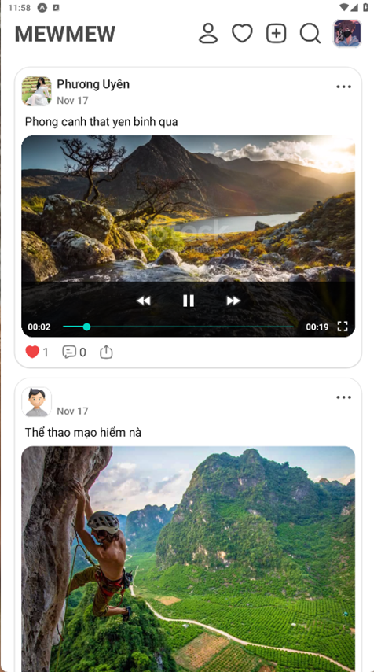

MEWMEW: Full Stack Social Media Mobile Application Documentation
MEWMEW is a full-stack social media mobile application developed using React Native for the frontend and Supabase for the backend. The application provides an interactive platform for users to connect, share posts, and manage their social profiles with real-time features.

Features
User Features
1.	User Management
o	Account creation, login, and profile picture update.
2.	Posts
o	Users can create, edit, delete, and like posts.
o	Add comments to posts and view comments from other users.
3.	Real-Time Chat
o	One-on-one messaging with other users.
o	Real-time updates for new messages on the chat screen.
4.	Notifications
o	Real-time notifications for likes, comments, and new messages.
5.	Search
o	Search post

Admin Panel
1.	User Management
o	View, edit, delete user accounts.
2.	Post Management
o	View, edit, and delete posts
3.	Comment Management
o	View and delete comments.
Technology Stack
Frontend Libraries
•	React Native
•	Redux Toolkit
•	Expo Router
•	Expo Camera
•	Expo Image Picker
•	React Native Chart Kit
•	React Native Paper
•	React Native Snap Carousel
Backend Services
•	Supabase
•	PostgreSQL
•	Supabase Authentication
•	Supabase Realtime
•	Supabase Storage

Testing Instructions
To test the application:
1.	For Android Users:
o	Download Expo Go on your Android smartphone.
o	Scan the provided QR code below within Expo Go.

o	 

2.	For iOS Users:
o	Download Expo Go on your Apple smartphone.
o	Scan the provided QR code below within Expo Go.
 
Note: The backend might experience delays due to free-tier hosting limitations. This delay is not a bug but an issue related to hosting.

Backend Setup
Environment Variables
Ensure the following environment variables are set in the file for the Supabase backend:
•	SUPABASE_URL
•	SUPABASE_KEY

Frontend Setup
1.	Navigate to the mobile project directory.
2.	Install dependencies with npm install.
3.	Start the application with npm expo start.

Supabase Configuration
Database
•	Set up tables for users, posts, comments, messages, and notifications in Supabase.
•	Include proper foreign keys for relational data management.
Realtime Features
•	Enable real-time updates for the posts, comments, and messages tables in Supabase.
Storage
•	Configure Supabase storage for user profile pictures and post images.

Starting the Application
Frontend
1.	Navigate to the mobile directory.
2.	Install dependencies using:
//bash
//Sao chép mã
npm install
3.	Start the app with:
//bash
//Sao chép mã
npm expo start
Backend
1.	Configure the Supabase backend through the Supabase dashboard.
2.	Set up environment variables as mentioned.

Postman API Documentation
Use Postman to explore the Supabase API and perform CRUD operations for testing.
User Manual
Backend
1.	Set up the Supabase backend through the Supabase dashboard.
2.	Ensure all tables, relationships, and realtime subscriptions are properly configured.
Frontend
1.	Clone the repository and navigate to the frontend project.
2.	Run the app locally or on Expo Go using the setup instructions above.

